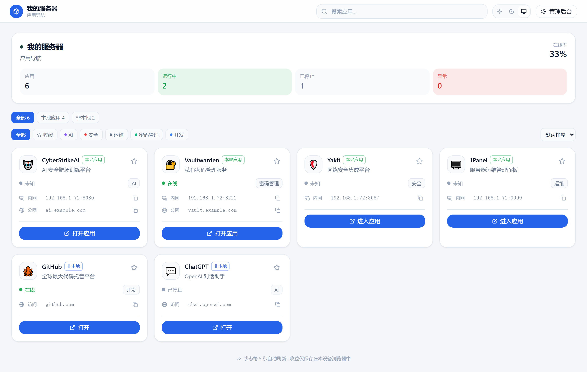
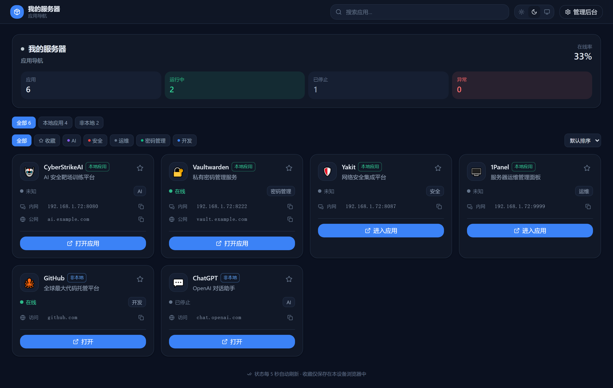
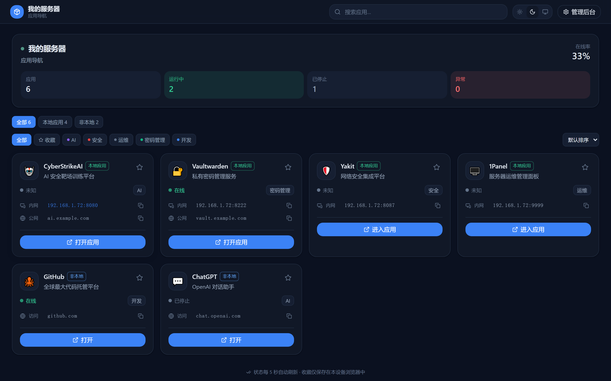
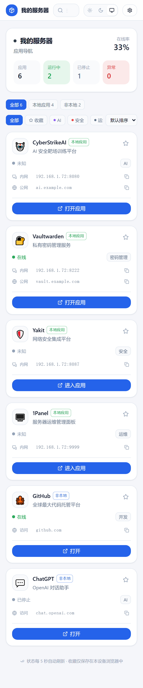
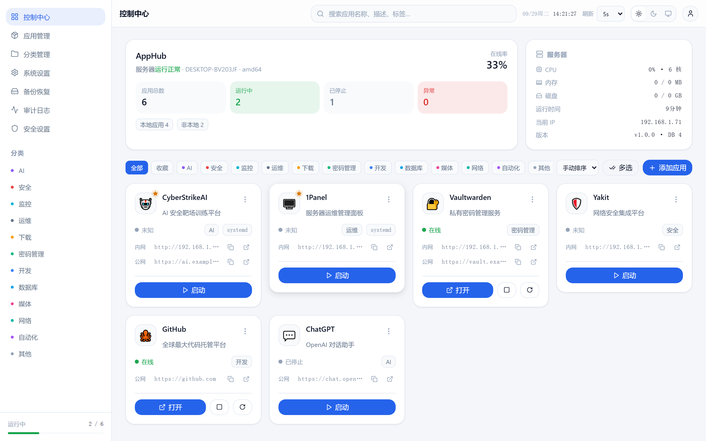
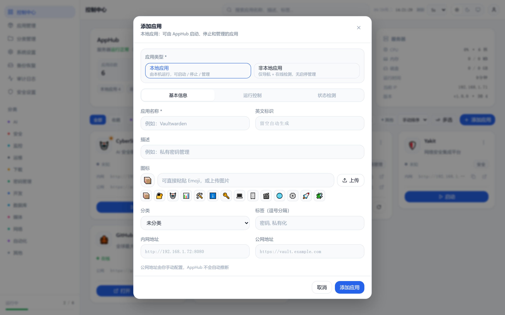
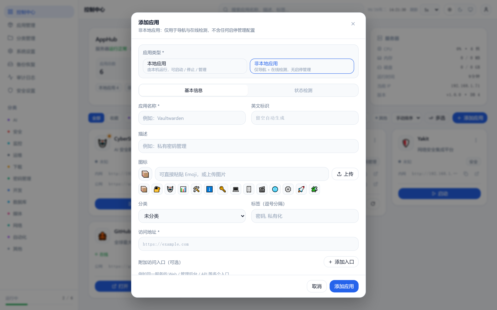
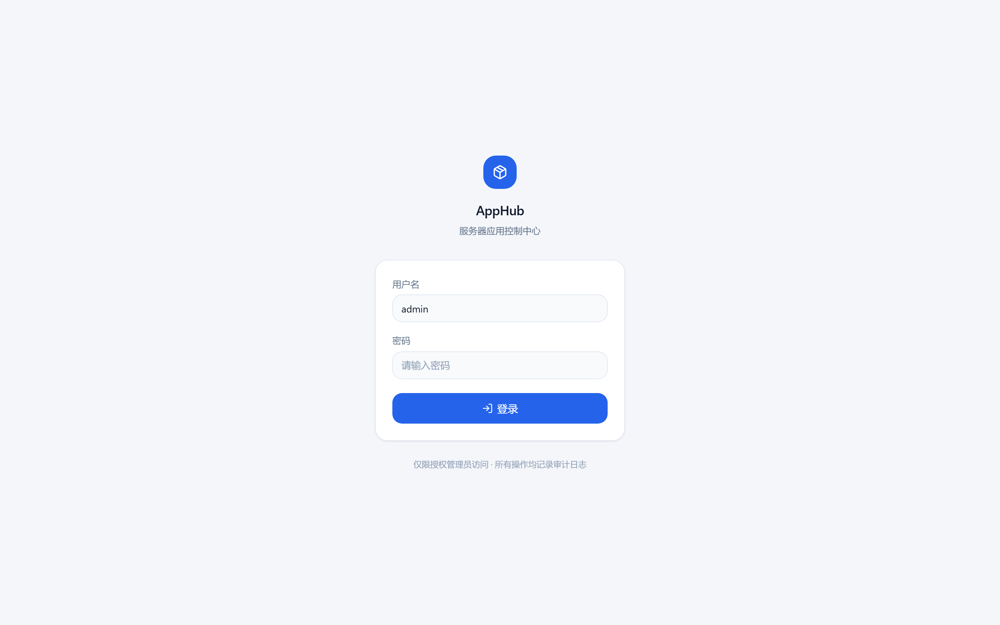

<div align="center">

# AppHub

**一个轻量、现代化的个人应用导航与管理中心（Personal Application Hub）**

一个 Go 二进制 + SQLite，把你的所有应用集中到一块面板：
本机应用可以启动、停止、看日志；外部网站与服务可以直接导航、看在线状态——
不用再记 IP、端口和命令。

[](#license)
[](https://go.dev)
[](https://vuejs.org)
[](#开发)

</div>

---

## 截图

### 前台 · 应用导航（无需登录）

打开浏览器即达：查看全部应用、实时状态、一键进入。

**浅色主题：**



**深色主题：**



**应用详情弹窗：** 点击卡片即可查看并复制访问地址



**移动端（390px）：** 支持手机浏览器"添加到主屏幕"



### 后台 · 控制中心（需管理员登录）



### 添加应用 · 按类型动态表单

**本地应用**（完整管理配置）：



**非本地应用**（仅导航 + 在线检测）：



**登录页：**



## 两种应用类型

AppHub 的核心产品模型只有一句话：

| | 本地应用（LOCAL） | 非本地应用（EXTERNAL） |
|---|---|---|
| **定位** | 本机运行、可管理的服务 | 别处的 Web 服务 / 第三方网站 |
| **举例** | CyberStrikeAI、Vaultwarden、1Panel | GitHub、ChatGPT、NAS 管理页 |
| **导航** | ✅ 内网 / 公网 / 附加入口 | ✅ 访问地址 / 附加入口 |
| **在线状态** | ✅ HTTP / TCP / 进程 / systemd | ✅ HTTP / TCP |
| **启动 / 停止 / 重启** | ✅ systemd 或自定义命令 | ❌ 后端直接拒绝（400） |
| **日志 / PID / 命令** | ✅ | ❌ 不存在，也不会返回 |
| **开机自启** | ✅ 可选（默认关闭） | ❌ |

> 非本地应用不是"AppHub 管理的服务"，而是"AppHub 导航的目标"。
> 即使手工构造 HTTP 请求，对非本地应用调用启停接口也会被后端直接拒绝。

## 特性

- **前台只读导航**：无需登录，打开即用；搜索、分类、类型筛选、收藏（localStorage 本地存储）
- **双地址导航**：本地应用独立配置内网地址与公网地址（手动填写，不自动推断），另支持任意附加访问入口
- **四种在线检测**：HTTP（可配期望状态码）/ TCP / 进程 PID / systemd，后台统一轮询 + 缓存，浏览器不触发高频检测
- **两类应用控制**：
  - `systemd`：结构化调用 systemctl（服务名白名单校验，防注入），支持启停/重启/开机自启/journal 日志
  - `command`：结构化 executable+args（Shell 模式需显式开启并警示），独立进程组、超时、输出上限、优雅停止
- **状态机防抖**：STARTING / STOPPING 过渡态防重复操作，真实检测确认后立即更新
- **安全**：Argon2id 密码、Session（HttpOnly/SameSite）、CSRF 双重防护、登录失败锁定、限流、审计日志、安全 Header
- **批量操作**：多选批量启停（并发上限 3）、"启动全部"默认关闭需在设置开启
- **备份/恢复/迁移**：SQLite 一致性快照 + 配置 + 图标打包；恢复前自动备份；整机目录复制即可迁移
- **低资源**：空闲 RAM < 10MB、CPU ≈ 0%，日志/备份自动按保留期清理（SD 卡友好）
- **界面**：Vue3 + Tailwind，深浅色主题（跟随系统），移动端到 4K 自适应，PWA 可添加到主屏幕
- **前台/后台真隔离**：Public API 仅 GET、字段白名单（PublicAppDTO），不泄露命令、路径、PID、环境变量

## 目录结构（生产）

```
/opt/apphub                # 安装目录（可自定义）
├── apphub                 # 单一二进制（前端已嵌入）
├── config.yaml
├── data/apphub.db         # SQLite（WAL）
├── logs/                  # 自身日志（轮转 + 保留期清理）
├── backups/               # 备份（tar.gz）
├── runtime/               # PID 记录、应用输出日志
├── uploads/               # 应用图标
└── scripts/               # install / uninstall / manage / backup / restore / upgrade
```

## 快速开始

```bash
git clone https://github.com/tanglx02/apphub.git
cd apphub
./build.sh                 # 构建前端 + 双架构二进制；或直接下载 Release 压缩包
sudo ./scripts/install.sh
```

安装向导会依次询问：**安装目录**（默认 `/opt/apphub`，可自定义）、**监听地址**（默认 `0.0.0.0`）、
**端口**（默认 `18080`）、是否安装为 systemd 服务、是否开机自启。

安装完成后：

```bash
systemctl status apphub
# 浏览器打开
http://<服务器IP>:18080/
```

首次访问会引导创建管理员账户。之后：

- 日常使用打开 `http://<IP>:18080/`（前台导航）
- 管理应用进入 `http://<IP>:18080/admin`（后台）

> **默认不创建任何应用，也不开机自启任何应用。**

## 添加应用

后台"添加应用"时首先选择类型，表单按类型动态显示：

### 本地应用 · systemd

| 字段 | 值 |
|---|---|
| 应用类型 | 本地应用 |
| 管理方式 | systemd 服务 |
| 服务名 | `cyberstrike-ai.service` |
| 状态检测 | systemd（`systemctl is-active`） |

### 本地应用 · 自定义命令

| 字段 | 值 |
|---|---|
| 管理方式 | 自定义命令 |
| 启动命令 | `/opt/apps/vaultwarden/start.sh` |
| 停止命令 | `/opt/apps/vaultwarden/stop.sh` |
| 状态检测 | TCP `127.0.0.1:8222` |

> 保存时**不会**执行任何命令；表单提供"测试启动 / 测试停止 / 测试状态"按钮，由管理员主动验证。
> Shell 模式（`/bin/sh -c`）支持管道与重定向，但该应用将具备执行系统命令的能力，需显式开启并自担风险。

### 非本地应用

| 字段 | 值 |
|---|---|
| 应用类型 | 非本地应用 |
| 访问地址 | `https://github.com` |
| 健康检查 | http（默认使用访问地址，也可单独指定检测 URL） |
| 附加入口 | 可选：同一服务的 Web / 管理后台 / API 多个入口 |

## 管理脚本

```bash
sudo /opt/apphub/scripts/manage.sh      # 交互式中文菜单
/opt/apphub/scripts/manage.sh start | stop | restart | status | logs
```

| 脚本 | 用途 |
|---|---|
| `install.sh` | 一键安装（检测系统/架构/systemd、生成配置、创建服务） |
| `uninstall.sh` | 卸载（默认保留数据，可选备份后删除） |
| `manage.sh` | 交互式管理菜单（启停/日志/密码/备份/恢复） |
| `backup.sh` | 创建备份（优先使用 SQLite VACUUM INTO 一致性快照） |
| `restore.sh` | 恢复备份（停止服务 → 自动备份当前 → 恢复 → 启动） |
| `upgrade.sh` | 升级（备份 → 替换 → 迁移 → 健康检查 → 失败自动回滚） |

## 备份与迁移

备份内容：`config.yaml`、SQLite 一致性快照、上传图标、元信息。

```bash
# 方式一：脚本
sudo /opt/apphub/scripts/backup.sh

# 方式二：后台 → 备份恢复 → 创建备份（可下载）
```

**整机迁移**：把安装目录整个复制到新设备 → 安装 AppHub → `restore.sh` 选择备份恢复 → 重启。

## 升级

```bash
sudo ./scripts/upgrade.sh ./dist/apphub-linux-arm64
```

流程：停止服务 → 备份到 `backups/pre-upgrade-<时间>/` → 替换程序 → 数据库迁移 →
启动 → 健康检查 → 失败自动回滚旧程序与旧数据库并重启。

## 配置

`config.yaml` 完整示例见 [config.example.yaml](config.example.yaml)。所有路径支持相对安装目录，整机目录复制即可迁移。

```yaml
server:
  host: 0.0.0.0
  port: 18080
  https: false          # 启用后默认自动生成自签名证书
  redirect_http: false
  trusted_proxies: ""   # 有反向代理时填写，如 127.0.0.1/32
status:
  interval: 5           # 后台状态检测周期（秒）
security:
  session_timeout: 86400
  login_max_fails: 5
  rate_limit_per_min: 120
```

大部分设置（含"前台导航"开关、标题、默认主题、是否显示资源等）可在后台
**设置 → 系统设置** 中修改并即时生效；监听地址 / 端口 / HTTPS 变更需重启服务。

## API

统一前缀 `/api/v1/`，响应包络 `{success, data, message, request_id}`。

**公开（匿名，只读）：**

```
GET /api/v1/public/config        前台配置
GET /api/v1/public/apps          公开应用列表（DTO 白名单字段）
GET /api/v1/public/categories    公开分类
GET /api/v1/public/summary       概览统计
GET /api/v1/public/overview      一次返回以上全部（前台轮询推荐）
GET /uploads/{name}              应用图标
```

**管理（需会话 + CSRF）：**

```
POST /api/v1/auth/login|setup|logout          GET /api/v1/auth/me
GET|POST|PUT|DELETE /api/v1/apps[...]         应用 CRUD / reorder / batch / export / import
POST /api/v1/apps/:id/start|stop|restart      服务控制（EXTERNAL 返回 400）
GET  /api/v1/apps/:id/logs?follow=1           日志（支持 SSE 实时流）
GET|POST|PUT|DELETE /api/v1/apps/:id/endpoints  附加访问入口
GET  /api/v1/categories ...                   分类
GET  /api/v1/system/info|resources|events     主机信息 / SSE 状态流
GET|PUT /api/v1/settings                      设置
GET|DELETE /api/v1/audit                      审计日志
GET|POST /api/v1/backups ...                  备份 / 恢复
```

**CLI：**

```bash
apphub --version               # AppHub v1.x.x
apphub --check                 # 环境与配置自检
apphub --migrate               # 数据库迁移后退出
apphub --reset-admin-password  # 交互式重置密码
apphub --backup [目录]          # 命令行备份
apphub --restore <文件>         # 命令行恢复
```

## 故障排查

```bash
systemctl status apphub                 # 服务状态
journalctl -u apphub -n 100             # 最近日志
curl http://127.0.0.1:18080/health      # 健康检查（200）
curl http://127.0.0.1:18080/ready       # 就绪检查（数据库异常返回 503）
/opt/apphub/apphub --check              # 配置自检
```

| 现象 | 处理 |
|---|---|
| 服务起不来 | `journalctl -u apphub -n 50`，常见为端口占用或目录权限 |
| 忘记密码 | `sudo /opt/apphub/scripts/manage.sh` → 重置管理员密码 |
| 应用状态一直"启动中" | 检查启动命令与状态检测目标是否匹配 |
| systemctl 报权限错误 | root 运行，或确认 `/etc/sudoers.d/apphub` 存在且 `visudo -cf` 通过 |
| 非本地应用显示"已停止"文案 | 不会出现；非本地应用只会显示"在线 / 无法访问 / 未知" |
| SD 卡空间不足 | 减小日志 / 备份保留天数，两者均自动清理 |

## 安全建议

- 通过 Tailscale / FRP / Cloudflare Tunnel 暴露公网时，**务必开启 HTTPS 并使用强密码**
- 后台默认全局需要登录，前台仅暴露只读导航数据，禁止搜索引擎索引（`X-Robots-Tag: noindex, nofollow`）
- Shell 模式应用具备执行系统命令的能力，请确保后台只有可信管理员访问
- 定期执行备份；升级脚本在失败时会自动回滚

## 开发

```bash
./build.sh              # 前端 + 后端全量构建 → dist/
./build.sh arm64        # 仅构建 arm64
./build.sh --skip-web   # 使用已有 web/dist
cd web && npm run dev   # 前端开发（API 代理到 18080）
go test ./...           # 单元测试（8 个包）
bash tests/integration/run.sh   # 集成测试（57 项断言）
```

源码结构、模块说明与设计决定见 [PROJECT_SPEC.md](PROJECT_SPEC.md) 与
[DEVELOPMENT_STATE.md](DEVELOPMENT_STATE.md)。

## 平台说明

AppHub 是纯 Go 静态二进制，可在主流 Linux 环境（amd64 / arm64）部署。
目前实际测试平台：Armbian 26.11（aarch64）与 Windows（开发环境），
未在其他平台做过完整验证，请以实际测试为准。systemd 是 Linux 环境下
管理本地应用的推荐方式，但不是 AppHub 产品身份的一部分。

## 许可

MIT
